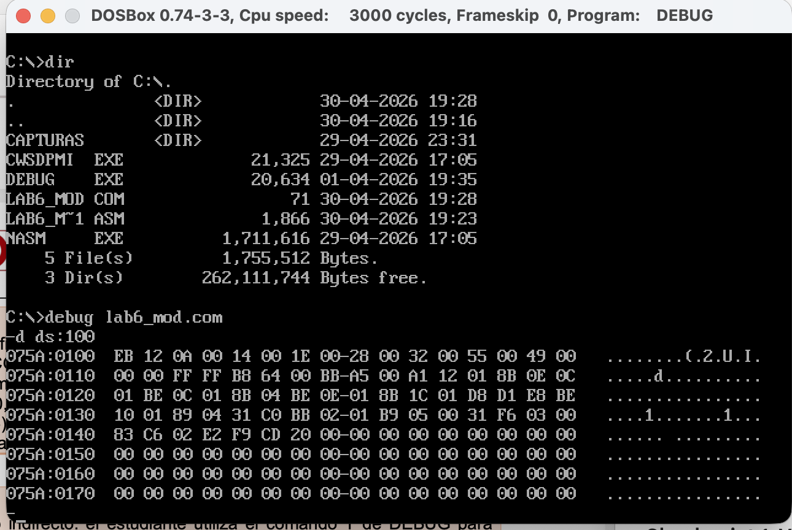
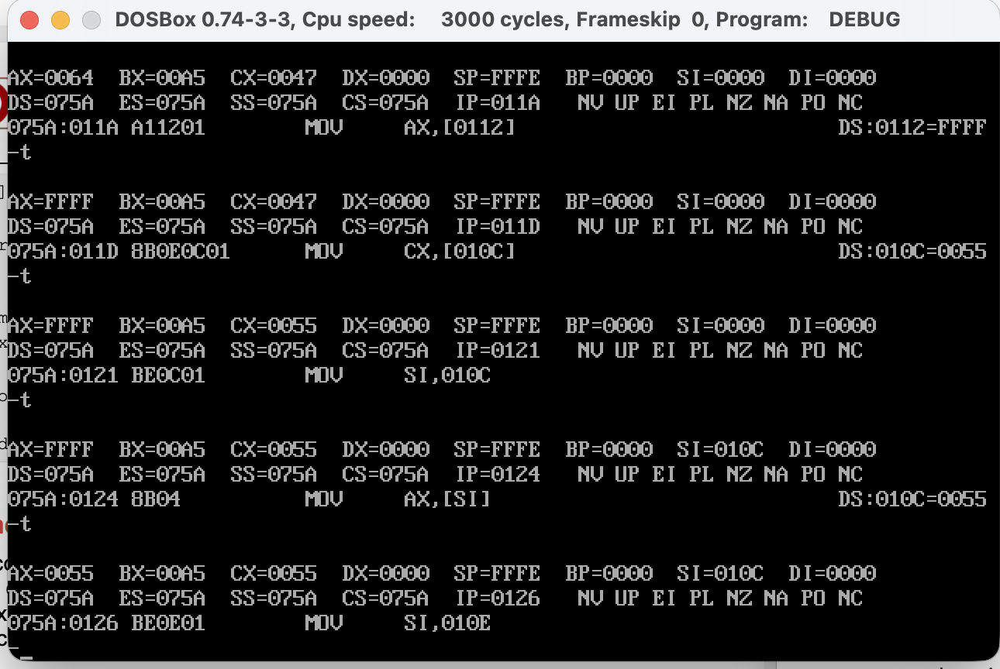
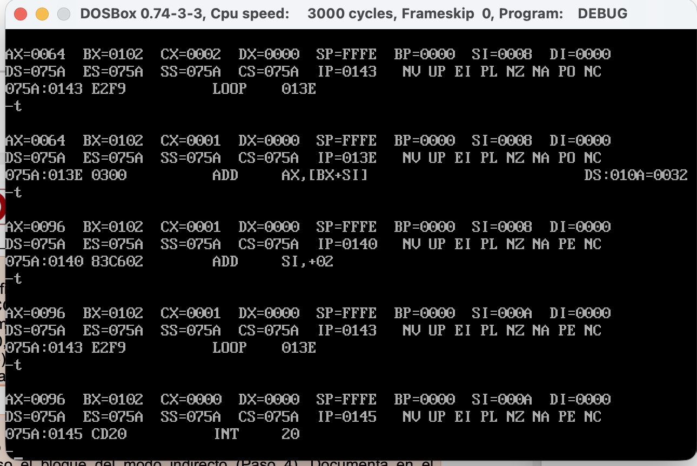

# Laboratorio: Modos de Direccionamiento en x86 (NASM)

## Información del Estudiante
* **Nombre:** Andrea Valentina Rivera Fernández
* **Código:** 1152444
* **Institución:** Universidad Francisco de Paula Santander (UFPS)
* **Materia:** Arquitectura de Computadores
* **Unidad:** 6 - Post-Contenido 2
* **Año:** 2026

## Resumen del Proyecto
Este laboratorio demuestra la implementación y verificación de cuatro modos de direccionamiento fundamentales en la arquitectura x86: **Inmediato, Directo, Indirecto por Registro e Indexado**. Se utilizó NASM para la compilación y DEBUG en DOSBox para el rastreo de registros y memoria.

---

## Checkpoint 1: Estructura de Datos en Memoria
Se verificó la correcta carga de la estructura de datos mediante el comando `d ds:100`. Como se observa en la captura, los datos están almacenados en formato *Little-Endian*.

**Valores identificados en el Dump:**
* **Array (16-bit):** `0A 00` (10), `14 00` (20), `1E 00` (30), `28 00` (40), `32 00` (50).
* **Estructura Estudiante:** `55 00` (nota1 = 85) y `49 00` (nota2 = 73).
* **Variable FFFFh:** Ubicada en el offset correspondiente tras la estructura.

---

## Checkpoint 2: Trazado del Modo Indirecto
Se realizó el seguimiento paso a paso del modo indirecto, donde el registro `SI` actúa como puntero a las variables de memoria.

**Tabla de Trazado de Registros:**

| Instrucción | Registro Modificado | Valor Resultante | Descripción |
| :--- | :--- | :--- | :--- |
| `MOV AX, [0112]` | **AX** | `FFFF` | Modo Directo: Carga valor de var_x. |
| `MOV CX, [010C]` | **CX** | `0055` | Modo Directo: Carga nota1 (85 decimal). |
| `MOV SI, 010C` | **SI** | `010C` | Carga la dirección (puntero) de nota1. |
| `MOV AX, [SI]` | **AX** | `0055` | **Modo Indirecto:** Acceso al valor vía SI. |
| `MOV SI, 010E` | **SI** | `010E` | Carga la dirección (puntero) de nota2. |

---

## Checkpoint 3: Verificación del Modo Indexado
Se validó el funcionamiento del bucle de suma acumulada utilizando el direccionamiento indexado `[BX + SI]`, donde `BX` es la base del array y `SI` el índice.

**Resultados del Bucle:**
* **Fórmula de Dirección Efectiva:** $EA = [BX + SI]$.
* **Valor Final AX:** Al finalizar las iteraciones (cuando `CX = 0000`), el registro **AX contiene `0096`**, que equivale a 150 en decimal ($10+20+30+40+50$).
* **Control de Flujo:** Se observa la instrucción `LOOP 013E` decrementando `CX` correctamente hasta terminar el proceso.

---

## Conclusiones
1. Se demostró que el **Modo Indirecto** permite una manipulación dinámica de datos al utilizar registros como punteros, facilitando el acceso a estructuras tipo *struct*.
2. El **Modo Indexado** es la forma más eficiente para recorrer arreglos, permitiendo calcular direcciones de memoria en tiempo de ejecución mediante la suma de una base y un desplazamiento.
3. El uso de **DEBUG** permitió confirmar que la arquitectura x86 maneja los datos en memoria de forma invertida (*Little-Endian*), un concepto clave para la depuración de bajo nivel.
